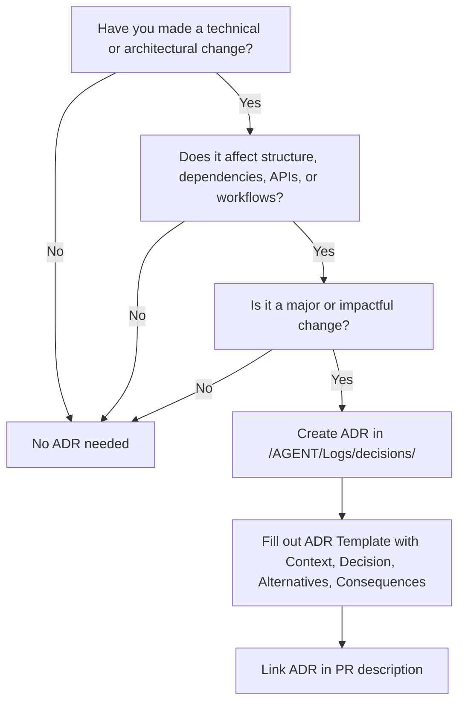

# ADR Guidelines — When and How to Log an Architectural Decision Record

## What is an ADR?

An **Architectural Decision Record (ADR)** is a short document that captures an important technical decision made for this project — including its context, the chosen option, alternatives considered, and the consequences.

Think of ADRs as a **project's decision diary**:

- They prevent "Why did we do this?" confusion later.
- They help new contributors (human or agent) understand _why_ the current setup exists.
- They create a timeline of architectural evolution.

---

## When to Create an ADR

Log an ADR **whenever** a decision meets any of these criteria:

### 1. **Structural Changes**

- Adding/removing a major directory or refactoring the folder structure.
- Introducing or removing layers (e.g., moving to a Clean Architecture layout).

### 2. **Technology or Tooling Choices**

- Selecting a database, queue, logging framework, build system, or deployment tool.
- Changing a major dependency (framework upgrade, language version jump).

### 3. **API Contracts**

- Creating or altering public APIs, CLI commands, or module interfaces.
- Changing data formats (JSON → Protobuf) or adding new schemas.

### 4. **Process & Workflow**

- Altering CI/CD pipelines or branching strategies.
- Introducing new testing approaches (e.g., contract-first testing).

### 5. **Key Architectural Trade-Offs**

- Choosing between performance vs. maintainability.
- Accepting technical debt for short-term gain.

---

## When NOT to Create an ADR

Skip ADRs for:

- Minor style changes (variable names, lint rules).
- Internal refactors that don’t affect the structure or contracts.
- Small dependency version bumps (unless breaking changes are involved).

---

## ADR Creation Process

1. **Copy the ADR Template** from `/AGENT/Templates/ADR-Template.md`.
2. Name the file as: `/AGENT/Logs/decisions/ADR-YYYYMMDD-short-title.md`
3. Fill in all sections:
   - **Context**: Why this change is needed.
   - **Decision**: What’s being done and why.
   - **Alternatives**: Other approaches considered.
   - **Consequences**: Positive/negative impacts.

---

## Best Practices

- **One ADR per decision** — don’t lump unrelated changes together.
- **Link it** in PR descriptions when relevant.
- **Keep it short** — aim for 200–500 words.
- **Use clear language** — remember future readers may not know today’s context.
- **Update ADR status** if it becomes superseded or deprecated.

---

## Example

**Title:** Switch to PostgreSQL from MongoDB  
**Status:** Accepted  
**Date:** 2025-08-10

**Context:**  
MongoDB queries in our system were causing performance issues under heavy joins. Our team needed ACID compliance and better relational modeling.

**Decision:**  
Adopt PostgreSQL 15 as the primary datastore for all new services, migrating existing MongoDB collections over the next quarter.

**Alternatives Considered:**

- **Stay on MongoDB:** Familiar, but relational modeling poor.
- **MySQL:** Lacked some JSON query flexibility we wanted.

**Consequences:**  
✅ Strong relational modeling, better transaction handling.  
⚠ Migration effort required; learning curve for team.

---

# ADR Logging Flowchart

