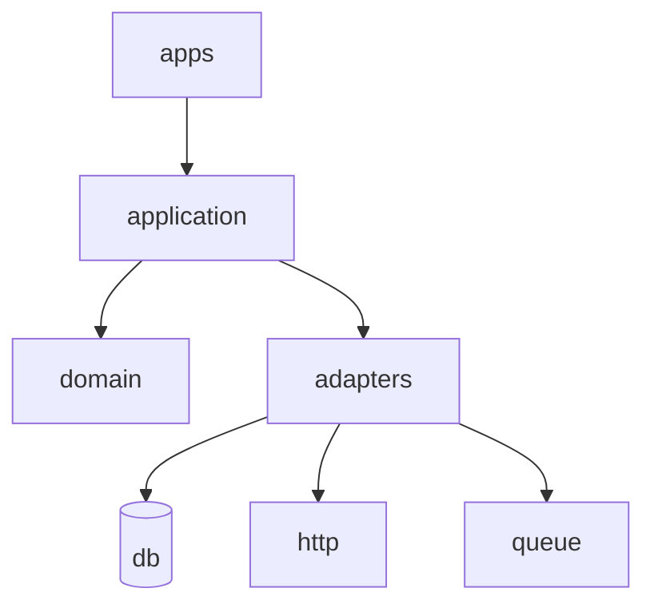

# CODEMAP — Repository Overview

_Last Updated:_ YYYY-MM-DD  
_Generated by:_ Workspace Optimizer — Single Agent Mode

---

## 1. Entrypoints

[List main application entrypoints, scripts, services, CLI commands.]

---

## 2. Architecture Snapshot (Diagram)

_A quick diagram helps future agents “see” the system at a glance._

_Notes:_ [List coupling rules, layer boundaries, and key invariants.]

## 3. Module & Folder Overview

| Path               | Purpose                                    | Key Dependencies | Owner/Contact |
| ------------------ | ------------------------------------------ | ---------------- | ------------- |
| `src/domain/`      | Business logic (pure, no I/O)              |                  |               |
| `src/application/` | Use-cases/services                         |                  |               |
| `src/adapters/`    | External system interfaces (HTTP, DB, etc) |                  |               |
| `src/packages/`    | Shared libs                                |                  |               |

## 4. Bounded Contexts

[Define each logical subdomain and its responsibilities.]

## 5. Cross-Cutting Concerns

| Concern | Location(s)         | Notes |
| ------- | ------------------- | ----- |
| Auth    | `src/adapters/auth` | ...   |
| Logging | `src/shared/logs`   | ...   |
| Config  | `src/shared/config` | ...   |

## 6. External Dependencies

| Dependency | Purpose | Where Used     |
| ---------- | ------- | -------------- |
| PostgreSQL | Storage | adapters/db    |
| Redis      | Cache   | adapters/cache |

## 7. Data Models & Contracts

[Key DTOs, schemas, or contract definitions. Link to OpenAPI/Protobuf/JSON-Schema if relevant.]

## 8. Testing Strategy

- Unit tests in `/tests/unit/`
- Contract tests in `/tests/contracts/`
- E2E tests in `/tests/e2e/`
- Single entry command: `test:all`

## 9. CI/CD Overview

[Summarize workflows, pipelines, deployment triggers, environments.]

## 10. Known Risks & Debt

[List high-priority refactor needs, unstable modules, tech debt.]

## 11. Future Agent Notes

[Tips, warnings, or best practices for future maintainers.]
